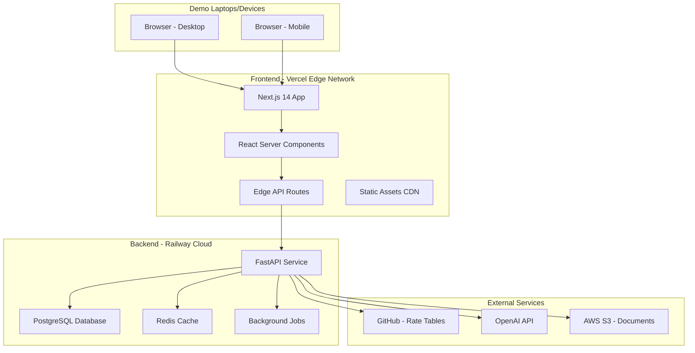

# DEMO_OVERALL_ARCHITECTURE - Technical Architecture

## P&C Insurance Platform Demo

### Architecture Overview



### Architectural Principles

1. **Simplicity First**: Every decision optimizes for demo readiness
2. **Real Enough**: Looks production-ready but shortcuts where safe
3. **Performance Visible**: Fast enough to impress, not necessarily optimize
4. **Modern Patterns**: Showcase current best practices
5. **Easy Recovery**: Can reset demo data quickly

### System Components

#### Frontend Architecture

```typescript
// Frontend Structure
app/                              # Next.js 14 App Directory
├── (auth)/
│   ├── login/
│   │   └── page.tsx             # Demo login (simple auth)
│   └── layout.tsx
├── (dashboard)/
│   ├── layout.tsx               # Dashboard shell
│   ├── page.tsx                 # Analytics overview
│   ├── quotes/
│   │   ├── page.tsx            # Quote list
│   │   ├── new/
│   │   │   └── page.tsx        # Quote wizard
│   │   └── [id]/
│   │       └── page.tsx        # Quote details
│   ├── policies/
│   │   ├── page.tsx            # Policy grid
│   │   └── [id]/
│   │       └── page.tsx        # Policy view
│   └── rates/
│       ├── page.tsx            # Rate manager
│       └── editor/
│           └── page.tsx        # Visual editor
├── api/
│   ├── trpc/
│   │   └── [trpc]/
│   │       └── route.ts        # tRPC endpoint
│   └── webhooks/
│       └── route.ts            # Demo webhooks
├── components/
│   ├── ui/                     # shadcn/ui components
│   ├── quotes/                 # Quote components
│   ├── policies/              # Policy components
│   └── charts/                # Demo analytics
└── lib/
    ├── trpc/                  # tRPC setup
    ├── api/                   # API client
    └── utils/                 # Helpers
```

#### Backend Architecture

```python
# Backend Structure
app/
├── main.py                     # FastAPI app entry
├── api/
│   ├── __init__.py
│   ├── quotes.py              # Quote endpoints
│   ├── policies.py            # Policy endpoints
│   ├── rates.py               # Rate management
│   └── ai.py                  # AI demo endpoints
├── core/
│   ├── config.py              # Settings
│   ├── database.py            # DB setup
│   ├── security.py            # Simple auth
│   └── deps.py                # Dependencies
├── models/
│   ├── __init__.py
│   ├── quote.py               # Quote models
│   ├── policy.py              # Policy models
│   └── rate_table.py          # Rate structures
├── schemas/
│   ├── __init__.py
│   ├── quote.py               # Pydantic schemas
│   ├── policy.py
│   └── rate.py
├── services/
│   ├── __init__.py
│   ├── rating_engine.py       # Demo calculations
│   ├── ai_service.py          # AI integrations
│   └── document_service.py    # PDF generation
├── db/
│   ├── migrations/            # Alembic migrations
│   └── seed.py                # Demo data seeder
└── tests/                     # Quick demo tests
```

### Data Architecture

#### Demo Database Schema

```sql
-- Simplified schema for demo
CREATE EXTENSION IF NOT EXISTS "uuid-ossp";

-- Customers (simplified)
CREATE TABLE customers (
    id UUID PRIMARY KEY DEFAULT uuid_generate_v4(),
    name VARCHAR(255) NOT NULL,
    email VARCHAR(255) UNIQUE NOT NULL,
    state VARCHAR(2) NOT NULL,
    created_at TIMESTAMP DEFAULT CURRENT_TIMESTAMP
);

-- Quotes (JSONB for flexibility)
CREATE TABLE quotes (
    id UUID PRIMARY KEY DEFAULT uuid_generate_v4(),
    quote_number VARCHAR(50) UNIQUE NOT NULL,
    customer_id UUID REFERENCES customers(id),
    status VARCHAR(50) DEFAULT 'draft',
    quote_data JSONB NOT NULL,  -- Flexible schema for demo
    premium DECIMAL(10, 2),
    created_at TIMESTAMP DEFAULT CURRENT_TIMESTAMP,
    expires_at TIMESTAMP
);

-- Policies (simplified from quotes)
CREATE TABLE policies (
    id UUID PRIMARY KEY DEFAULT uuid_generate_v4(),
    policy_number VARCHAR(50) UNIQUE NOT NULL,
    quote_id UUID REFERENCES quotes(id),
    customer_id UUID REFERENCES customers(id),
    policy_data JSONB NOT NULL,  -- Copied from quote
    status VARCHAR(50) DEFAULT 'active',
    effective_date DATE NOT NULL,
    expiration_date DATE NOT NULL,
    created_at TIMESTAMP DEFAULT CURRENT_TIMESTAMP
);

-- Rate Tables (JSONB for demo flexibility)
CREATE TABLE rate_tables (
    id UUID PRIMARY KEY DEFAULT uuid_generate_v4(),
    name VARCHAR(100) UNIQUE NOT NULL,
    version VARCHAR(20) NOT NULL,
    table_data JSONB NOT NULL,  -- Complete flexibility
    created_at TIMESTAMP DEFAULT CURRENT_TIMESTAMP,
    created_by VARCHAR(100)
);

-- Demo Analytics Events
CREATE TABLE events (
    id UUID PRIMARY KEY DEFAULT uuid_generate_v4(),
    event_type VARCHAR(50) NOT NULL,
    entity_type VARCHAR(50),
    entity_id UUID,
    event_data JSONB,
    created_at TIMESTAMP DEFAULT CURRENT_TIMESTAMP
);

-- Indexes for demo performance
CREATE INDEX idx_quotes_customer ON quotes(customer_id);
CREATE INDEX idx_quotes_status ON quotes(status);
CREATE INDEX idx_policies_customer ON policies(customer_id);
CREATE INDEX idx_events_type ON events(event_type);
CREATE INDEX idx_quotes_data ON quotes USING GIN (quote_data);
```

### API Architecture

#### RESTful + tRPC Hybrid

```python
# FastAPI REST endpoints
from fastapi import FastAPI, HTTPException
from typing import List, Optional
import asyncpg

app = FastAPI(
    title="PD Prime Demo API",
    version="0.1.0",
    docs_url="/api/docs"  # Swagger UI for demos
)

# Health check for Railway
@app.get("/health")
async def health():
    return {"status": "healthy", "version": "demo-1.0"}

# Quote endpoints
@app.post("/api/v1/quotes")
async def create_quote(quote: QuoteCreate) -> QuoteResponse:
    """Create a new insurance quote"""
    # Demo implementation
    pass

@app.get("/api/v1/quotes/{quote_id}")
async def get_quote(quote_id: UUID) -> QuoteResponse:
    """Retrieve quote details"""
    pass

@app.post("/api/v1/quotes/{quote_id}/calculate")
async def calculate_premium(
    quote_id: UUID,
    options: CalculationOptions
) -> PremiumResponse:
    """Real-time premium calculation"""
    pass

# AI Demo endpoint
@app.post("/api/v1/ai/analyze-risk")
async def analyze_risk(document: UploadFile) -> RiskAnalysis:
    """AI-powered risk analysis demo"""
    pass
```

```typescript
// tRPC for type-safe frontend communication
import { createTRPCRouter } from "@/server/api/trpc";

export const quoteRouter = createTRPCRouter({
  create: protectedProcedure.input(QuoteCreateSchema).mutation(async ({ input, ctx }) => {
    return ctx.apiClient.post("/quotes", input);
  }),

  calculate: protectedProcedure
    .input(
      z.object({
        quoteId: z.string().uuid(),
        options: CalculationOptionsSchema,
      })
    )
    .query(async ({ input, ctx }) => {
      return ctx.apiClient.post(`/quotes/${input.quoteId}/calculate`, input.options);
    }),
});
```

### Service Architecture

#### Microservice Boundaries (Monolith for Demo)

```python
# services/rating_engine.py
class RatingEngine:
    """Demo rating engine with mock calculations"""

    def __init__(self, db_pool: asyncpg.Pool, redis: Redis):
        self.db = db_pool
        self.cache = redis
        self.rate_tables = {}

    async def calculate_premium(
        self,
        quote_data: Dict[str, Any]
    ) -> PremiumCalculation:
        # Simple demo calculation
        base_rate = 1000.0

        # Territory factor
        territory_factor = await self._get_territory_factor(
            quote_data['state'],
            quote_data['zip_code']
        )

        # Vehicle factor (mock)
        vehicle_factor = 1.2 if quote_data.get('vehicle_type') == 'suv' else 1.0

        # AI risk score (mock)
        risk_score = await self._get_ai_risk_score(quote_data)
        risk_factor = 1.0 + (risk_score * 0.1)

        final_premium = base_rate * territory_factor * vehicle_factor * risk_factor

        return PremiumCalculation(
            base_premium=base_rate,
            factors={
                'territory': territory_factor,
                'vehicle': vehicle_factor,
                'risk': risk_factor
            },
            total_premium=final_premium,
            breakdown=self._generate_breakdown(final_premium)
        )
```

### Integration Architecture

#### External Service Integrations

```python
# services/ai_service.py
class AIService:
    """OpenAI integration for demo AI features"""

    def __init__(self, openai_key: str):
        self.client = OpenAI(api_key=openai_key)

    async def analyze_document(self, document: bytes) -> DocumentAnalysis:
        """Extract information from uploaded documents"""
        # For demo, use GPT-4 Vision or mock
        prompt = """
        Analyze this insurance document and extract:
        1. Driver information
        2. Vehicle details
        3. Driving history
        4. Risk factors
        """

        # Mock response for demo reliability
        return DocumentAnalysis(
            driver_info={"name": "John Demo", "license": "D1234567"},
            vehicle_info={"make": "Tesla", "model": "Model 3", "year": 2022},
            risk_factors=["Clean record", "Urban area"],
            confidence_score=0.95
        )

    async def generate_underwriting_recommendations(
        self,
        quote_data: Dict
    ) -> List[Recommendation]:
        """AI-powered underwriting suggestions"""
        # Mix real AI with reliable demo data
        pass
```

### Deployment Architecture

#### Railway Configuration

```yaml
# railway.toml
[build]
builder = "NIXPACKS"
buildCommand = "pip install -r requirements.txt"

[deploy]
startCommand = "uvicorn app.main:app --host 0.0.0.0 --port $PORT"
healthcheckPath = "/health"
healthcheckTimeout = 300

[[services]]
name = "postgres"
plugin = "postgresql"

[[services]]
name = "redis"
plugin = "redis"

[environments.production]
PYTHON_VERSION = "3.11"
```

#### Vercel Configuration

```json
// vercel.json
{
  "framework": "nextjs",
  "buildCommand": "npm run build",
  "outputDirectory": ".next",
  "regions": ["iad1"],
  "functions": {
    "app/api/trpc/[trpc]/route.ts": {
      "maxDuration": 30
    }
  }
}
```

### Security Architecture (Demo Level)

#### Simplified Authentication

```python
# core/security.py
from fastapi_users import FastAPIUsers
from fastapi_users.authentication import JWTStrategy

# Simple JWT auth for demo
def get_jwt_strategy() -> JWTStrategy:
    return JWTStrategy(
        secret="demo-secret-key",  # pragma: allowlist secret - Obviously change in production!
        lifetime_seconds=3600 * 24  # 24 hours for demo
    )

# Demo users with simple roles
DEMO_USERS = {  # pragma: allowlist secret - Demo passwords only
    "agent@demo.com": {"role": "agent", "password": "demo123"},  # pragma: allowlist secret
    "underwriter@demo.com": {"role": "underwriter", "password": "demo123"},  # pragma: allowlist secret
    "admin@demo.com": {"role": "admin", "password": "demo123"}  # pragma: allowlist secret
}
```

### Performance Optimizations (Demo Only)

```python
# Redis caching for instant demo responses
class DemoCache:
    def __init__(self, redis: Redis):
        self.redis = redis

    async def get_or_calculate(
        self,
        key: str,
        calculator: Callable,
        ttl: int = 300  # 5 minutes
    ):
        # Check cache first
        cached = await self.redis.get(key)
        if cached:
            return json.loads(cached)

        # Calculate and cache
        result = await calculator()
        await self.redis.setex(
            key,
            ttl,
            json.dumps(result, default=str)
        )
        return result
```

### Monitoring & Analytics (Demo Dashboard)

```python
# services/analytics_service.py
class DemoAnalytics:
    """Real-time metrics for impressive demo dashboard"""

    async def get_live_metrics(self) -> DashboardMetrics:
        return DashboardMetrics(
            quotes_today=random.randint(150, 200),
            conversion_rate=random.uniform(0.22, 0.28),
            average_premium=random.uniform(1200, 1500),
            processing_time=random.uniform(0.8, 1.5),
            ai_accuracy=random.uniform(0.92, 0.96)
        )
```

### Demo Reset Capability

```python
# db/seed.py
async def reset_demo_data():
    """Quick reset between demo sessions"""
    async with get_db_connection() as conn:
        # Clear existing data
        await conn.execute("TRUNCATE customers, quotes, policies CASCADE")

        # Insert fresh demo data
        await seed_customers(conn, count=100)
        await seed_quotes(conn, count=500)
        await seed_policies(conn, count=200)
        await seed_rate_tables(conn)

        # Reset Redis cache
        await redis.flushall()

    logger.info("Demo data reset complete!")
```

### WebSocket for Live Updates

```python
# Real-time updates for wow factor
@app.websocket("/ws/updates")
async def websocket_endpoint(websocket: WebSocket):
    await websocket.accept()

    while True:
        # Send live updates every 2 seconds
        update = {
            "type": "metrics_update",
            "data": await get_live_metrics()
        }
        await websocket.send_json(update)
        await asyncio.sleep(2)
```

### Architecture Decision Records (ADRs)

#### ADR-001: Monolith for Demo

- **Decision**: Single FastAPI service instead of microservices
- **Rationale**: Faster development, easier deployment, simpler demos
- **Consequences**: Will need refactoring for production

#### ADR-002: JSONB for Flexibility

- **Decision**: Use PostgreSQL JSONB for quote/policy data
- **Rationale**: Schema flexibility during demo iterations
- **Consequences**: Perfect for demos, need migration strategy later

#### ADR-003: Railway + Vercel

- **Decision**: Railway for backend, Vercel for frontend
- **Rationale**: Zero-config deployment, instant demos
- **Consequences**: May need AWS/GCP for production scale

---

**Architecture Tagline**: "Built for Speed, Designed for Scale"
