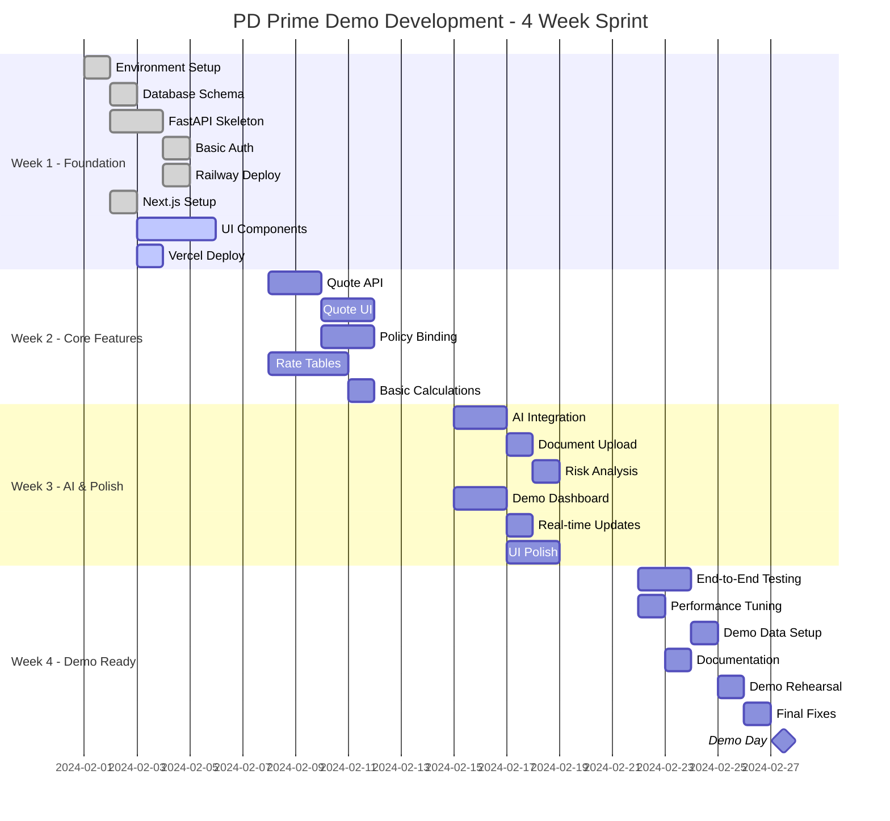

# DEMO_OVERALL_ROADMAP - 4-Week Sprint Plan

## P&C Insurance Platform Demo

### Roadmap Overview



### Week 1: Foundation Sprint

**Goal**: Get the basic infrastructure running with deployable skeleton apps

#### Day 1-2: Project Setup

```bash
# Backend setup checklist
□ Create GitHub repositories
□ Initialize Python project with Poetry
□ Set up FastAPI with basic structure
□ Configure PostgreSQL models with SQLAlchemy
□ Create Alembic migrations
□ Set up Redis connection
□ Configure environment variables

# Frontend setup checklist
□ Create Next.js 14 app with TypeScript
□ Install and configure Tailwind CSS
□ Set up shadcn/ui components
□ Configure tRPC or API client
□ Set up basic routing structure
□ Configure ESLint and Prettier
```

#### Day 3-4: Core Infrastructure

```yaml
backend_deliverables:
  - Health check endpoint working
  - Database connection verified
  - Basic JWT authentication
  - Swagger documentation active
  - First deployment to Railway

frontend_deliverables:
  - Landing page with demo login
  - Dashboard layout component
  - Navigation structure
  - Responsive design working
  - First deployment to Vercel
```

#### Day 5: Integration & Testing

```yaml
integration_tasks:
  - Frontend calling backend API
  - Authentication flow working
  - Environment variables set
  - Both apps accessible via public URLs
  - Basic error handling

success_criteria:
  - Can log in and see dashboard
  - No CORS issues
  - Both deployments stable
```

### Week 2: Core Features Sprint

**Goal**: Implement the core insurance functionality

#### Day 6-7: Quote Generation

```python
# Backend implementation
@app.post("/api/v1/quotes")
async def create_quote(
    quote_request: QuoteCreateRequest,
    current_user: User = Depends(get_current_user),
    db: AsyncSession = Depends(get_db)
) -> QuoteResponse:
    """
    Implement:
    - Quote data validation
    - Basic premium calculation
    - Save to database
    - Return quote details
    """
    pass
```

```typescript
// Frontend implementation
export default function NewQuotePage() {
  // Multi-step form wizard
  // - Customer information
  // - Vehicle/Property details
  // - Coverage selection
  // - Review and submit
}
```

#### Day 8-9: Policy Binding

```yaml
features_to_implement:
  backend:
    - Convert quote to policy endpoint
    - Policy number generation
    - Policy document creation (PDF)
    - Status management

  frontend:
    - Quote review page
    - Bind policy button
    - Policy view page
    - Document download
```

#### Day 10: Rate Management

```yaml
rate_table_features:
  - CRUD operations for rate tables
  - Visual rate table editor
  - Git integration (mock for demo)
  - Version history display
  - Real-time rate lookup API
```

### Week 3: AI & Polish Sprint

**Goal**: Add the wow factors and polish the UI

#### Day 11-12: AI Integration

```python
# AI features to implement
class AIService:
    async def analyze_driver_document(self, file: UploadFile):
        """Extract driver info from license/documents"""

    async def calculate_risk_score(self, customer_data: dict):
        """Generate AI risk score with explanation"""

    async def generate_recommendations(self, quote: Quote):
        """Suggest coverage changes, discounts, etc"""
```

#### Day 13: Document Processing

```yaml
document_features:
  - File upload UI with drag-drop
  - Progress indicators
  - AI extraction results display
  - Manual override capability
  - Mock processing for reliability
```

#### Day 14-15: Demo Dashboard

```typescript
// Real-time analytics dashboard
export default function DashboardPage() {
  // Components:
  // - Live quote counter
  // - Conversion funnel
  // - Premium trends chart
  // - AI accuracy metrics
  // - Recent activity feed
}
```

#### Day 16-17: UI Polish

```yaml
polish_tasks:
  - Loading states everywhere
  - Error boundaries
  - Toast notifications
  - Smooth animations
  - Mobile responsiveness
  - Dark mode (optional)
  - Micro-interactions
```

### Week 4: Demo Preparation Sprint

**Goal**: Ensure flawless demo execution

#### Day 18-19: Testing & Fixes

```yaml
testing_checklist:
  - Complete demo flow walkthrough
  - Cross-browser testing
  - Mobile device testing
  - Load testing (50 concurrent users)
  - Error scenario testing
  - Data reset functionality
```

#### Day 20: Performance Optimization

```python
# Performance optimizations
- Add Redis caching to all expensive queries
- Optimize database queries (add indexes)
- Enable response compression
- Lazy load frontend components
- Optimize images
```

#### Day 21: Demo Data & Content

```python
# demo_data.py
async def seed_demo_data():
    """
    Create:
    - 100 realistic customers
    - 50 vehicles with variety
    - 200 quotes in various states
    - 100 active policies
    - Compelling analytics data
    """
```

#### Day 22-23: Documentation & Rehearsal

```yaml
documentation:
  - API documentation complete
  - Demo script written
  - Architecture diagrams ready
  - Quick start guide
  - Known limitations doc

rehearsal_plan:
  - Full run-through with timer
  - Backup plans for failures
  - Q&A preparation
  - Technical deep-dive ready
```

#### Day 24: Final Polish

```yaml
final_checklist:
  - [ ] All features working
  - [ ] Demo data looks realistic
  - [ ] Performance acceptable
  - [ ] URLs are clean
  - [ ] SSL certificates valid
  - [ ] Backup instance ready
  - [ ] Team briefed on roles
```

### Milestone Tracking

#### Week 1 Milestones

| Milestone       | Success Criteria   | Due   | Status |
| --------------- | ------------------ | ----- | ------ |
| Dev Environment | Both apps deployed | Day 3 | 🟡     |
| Basic Auth      | Can login/logout   | Day 4 | 🟡     |
| Infrastructure  | Stable deployments | Day 5 | 🟡     |

#### Week 2 Milestones

| Milestone      | Success Criteria   | Due    | Status |
| -------------- | ------------------ | ------ | ------ |
| Quote Flow     | End-to-end working | Day 7  | ⚪     |
| Policy Binding | PDF generation     | Day 9  | ⚪     |
| Rate Tables    | CRUD + lookup      | Day 10 | ⚪     |

#### Week 3 Milestones

| Milestone   | Success Criteria   | Due    | Status |
| ----------- | ------------------ | ------ | ------ |
| AI Features | 3 AI demos working | Day 12 | ⚪     |
| Dashboard   | Real-time updates  | Day 15 | ⚪     |
| UI Polish   | Professional look  | Day 17 | ⚪     |

#### Week 4 Milestones

| Milestone        | Success Criteria     | Due    | Status |
| ---------------- | -------------------- | ------ | ------ |
| Testing Complete | No critical bugs     | Day 19 | ⚪     |
| Performance      | <2s response times   | Day 20 | ⚪     |
| Demo Ready       | Successful rehearsal | Day 23 | ⚪     |

### Risk Management

#### Technical Risks

| Risk               | Impact | Mitigation            | Owner        |
| ------------------ | ------ | --------------------- | ------------ |
| AI API failures    | High   | Mock fallbacks ready  | AI Lead      |
| Performance issues | Medium | Aggressive caching    | Backend Lead |
| Railway outage     | High   | Backup on Render.com  | DevOps       |
| Last-minute bugs   | High   | Feature freeze Day 22 | PM           |

#### Demo Risks

| Risk              | Impact   | Mitigation                            | Owner     |
| ----------------- | -------- | ------------------------------------- | --------- |
| Internet issues   | Critical | Local hotspot backup                  | Demo Lead |
| Live coding fails | Medium   | Pre-recorded backup                   | Tech Lead |
| Question stumps   | Low      | "Great question, let's discuss after" | All       |

### Resource Allocation

```yaml
team_structure:
  full_time:
    - Full-stack Developer (You)
    - UI/UX Designer (Part-time Week 3)

  advisors:
    - Insurance Domain Expert (2hrs/week)
    - Demo Coach (Week 4)

  ai_assistance:
    - Cursor/Copilot (continuous)
    - ChatGPT/Claude (architecture decisions)
```

### Daily Standup Schedule

```yaml
week_1_2:
  time: "9:00 AM"
  duration: "15 min"
  format: "What I did / Will do / Blockers"

week_3_4:
  time: "9:00 AM & 5:00 PM"
  duration: "15 min each"
  format: "Progress / Issues / Demo readiness"
```

### Success Metrics

#### Development Velocity

```yaml
week_1:
  target: "Infrastructure 100% complete"
  stretch: "First API endpoint working"

week_2:
  target: "Core features functional"
  stretch: "Basic UI polish started"

week_3:
  target: "All features working"
  stretch: "Performance optimized"

week_4:
  target: "Demo flawless"
  stretch: "Backup demos prepared"
```

### Communication Plan

#### Stakeholder Updates

```yaml
weekly_updates:
  when: "Fridays 4 PM"
  format: "Email with screenshots/videos"
  content:
    - Progress against roadmap
    - Key achievements
    - Upcoming milestones
    - Risks and mitigations

demo_invites:
  when: "Week 3, Day 3"
  audience:
    - Executives
    - Potential customers
    - Technical evaluators
    - Team members
```

### Post-Demo Plan (Teaser)

```yaml
immediate_next_steps:
  day_1_after_demo:
    - Collect all feedback
    - Team retrospective
    - Plan Phase 2

  week_1_after_demo:
    - Address critical feedback
    - Prepare production roadmap
    - Start Rust proof-of-concept

  month_1_after_demo:
    - Production architecture
    - Security hardening
    - Performance optimization
    - Real integrations
```

---

**Roadmap Motto**: "Ship Fast, Demo Well, Learn Everything"

**Key Principle**: Every day counts. Stay focused on demo success.
