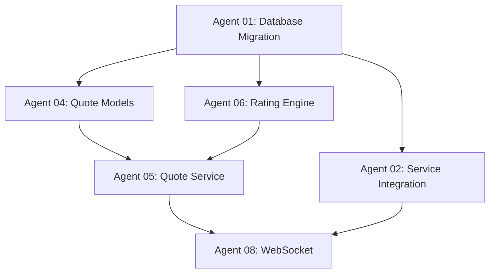

# Wave 2 Best Practices Documentation

## Executive Summary

This document captures the best practices learned from Wave 2 implementation of the full production insurance platform. These patterns should be used as the foundation for all future SAGE waves to ensure consistency, quality, and success.

## Table of Contents

1. [Agent Deployment Patterns](#agent-deployment-patterns)
2. [Implementation Strategies](#implementation-strategies)
3. [Quality Assurance Patterns](#quality-assurance-patterns)
4. [Communication Protocols](#communication-protocols)
5. [Technical Standards](#technical-standards)
6. [Failure Prevention](#failure-prevention)

## Agent Deployment Patterns

### 1. Dependency Graph Validation

**MANDATORY**: Before deploying any agent, create and validate a complete dependency graph.



**Implementation**:
- Map all agent dependencies before Wave start
- Verify completion of prerequisites before agent deployment
- Use dependency gates to prevent premature starts

### 2. Parallel Agent Groups

Deploy agents in coordinated parallel groups to maximize efficiency:

**Group 1: Foundation (Days 1-2)**
- Database Migration Specialist
- Service Integration Specialist
- Connection Pool Specialist

**Group 2: Core Features (Days 3-6)**
- Quote Model Builder
- Quote Service Developer
- Rating Engine Architect
- Rating Calculator

**Group 3: Real-Time & Security (Days 7-10)**
- WebSocket Engineer
- SSO Integration Specialist
- OAuth2 Server Developer
- MFA Implementation Expert

**Group 4: Compliance & Performance (Days 11-14)**
- SOC 2 Compliance Engineer
- Performance Optimization Expert
- Deployment Specialist
- Integration Test Master

### 3. Synchronization Checkpoints

Implement mandatory synchronization points:

- **Day 2**: Foundation verification checkpoint
- **Day 6**: Core feature integration checkpoint
- **Day 10**: Security and real-time validation checkpoint
- **Day 14**: Production readiness checkpoint

## Implementation Strategies

### 1. Defensive Programming First

**Pattern**: Rust-like ownership model in Python

```python
# MANDATORY: All models use Pydantic with frozen=True
@beartype
class QuoteModel(BaseModelConfig):
    model_config = ConfigDict(
        frozen=True,           # IMMUTABLE by default
        extra="forbid",        # Strict validation
        validate_assignment=True,
        str_strip_whitespace=True,
        validate_default=True
    )

    quote_id: str = Field(..., min_length=1, max_length=50)
    premium: Decimal = Field(..., ge=0, decimal_places=2)

# MANDATORY: Use Result types for error handling
@beartype
async def create_quote(data: QuoteCreate) -> Result[Quote, str]:
    try:
        # Business logic
        return Ok(quote)
    except ValidationError as e:
        return Err(f"Validation failed: {e}")
```

### 2. Performance-First Development

**Pattern**: Mandatory performance monitoring for all functions >10 lines

```python
@beartype
@performance_monitor("quote_creation", max_duration_ms=2000)
async def create_quote(quote_data: QuoteCreate) -> Result[Quote, str]:
    # Implementation must complete within 2000ms
    pass
```

**Requirements**:
- Functions >10 lines MUST have performance benchmarks
- Memory allocation <1MB per function
- No memory growth >1MB in 1000 iterations
- Performance cannot degrade >5% between commits

### 3. Service-Oriented Architecture

**Pattern**: Clear service boundaries with dependency injection

```python
class QuoteService:
    def __init__(
        self,
        db: Database,
        cache: Cache,
        rating_engine: Optional[RatingEngine] = None,
    ) -> None:
        self._db = db
        self._cache = cache
        self._rating_engine = rating_engine
```

**Benefits**:
- Clear separation of concerns
- Testable boundaries
- Maintainable code structure
- Reusable components

## Quality Assurance Patterns

### 1. Master Ruleset Compliance

**MANDATORY**: All code must pass master ruleset validation

```bash
# Pre-commit validation
./scripts/validate-pydantic-compliance.sh
./scripts/validate-performance-gates.sh
./scripts/validate-master-ruleset.sh
```

**Requirements**:
- 100% Pydantic model usage
- 100% beartype decorator coverage
- No `Any` types except at system boundaries
- Result types for all error handling

### 2. Testing Strategy

**Unit Testing Requirements**:
- 95%+ code coverage
- All business logic tested
- Mock external dependencies
- Validate error conditions
- Performance benchmarking

**Integration Testing Requirements**:
- End-to-end workflows
- Cross-service communication
- Database integration
- Real-time features

**Load Testing Requirements**:
- 10,000 concurrent users
- Connection pool stress testing
- Memory leak detection
- Performance degradation analysis

### 3. Security by Design

**Requirements**:
- Role-based access control (RBAC)
- Comprehensive audit logging
- Multi-factor authentication (MFA)
- Zero-trust architecture
- SOC 2 Type II compliance

## Communication Protocols

### 1. Agent Status Reporting

**MANDATORY**: Agents must report status every 4 hours

```markdown
# Agent XX Status Update

## Timestamp: 2025-07-05 12:00:00 UTC

### Current Status
- [Current work description]

### Progress
- [x] Completed tasks
- [ ] In progress tasks
- [ ] Pending tasks

### Blockers
- [List any blockers with details]

### Next Steps
- [Planned next actions]

### Dependencies
- [Required from other agents]

### Confidence Level
XX% - [Justification]
```

### 2. Blocker Reporting

**MANDATORY**: Report blockers within 1 hour of detection

```markdown
# Agent XX Blocker Report

## Timestamp: 2025-07-05 XX:XX:XX UTC

## Blocker Description
[Clear description of the blocker]

## Required Resolution
[What needs to be done to unblock]

## Impact
[How this affects timeline and dependencies]

## Attempted Solutions
[What has been tried]

## Help Needed
[Specific assistance required]
```

### 3. Completion Verification

**MANDATORY**: Dependent agents must verify completion

```markdown
# Agent XX Completion Verification

## Verified Components
- [x] Component 1 - Tested and working
- [x] Component 2 - Integrated successfully
- [ ] Component 3 - Pending verification

## Integration Tests
- [x] Unit tests passing
- [x] Integration tests passing
- [x] Performance benchmarks met

## Handoff Status
Ready for dependent agents: [Agent YY, Agent ZZ]
```

## Technical Standards

### 1. Code Organization

```
src/pd_prime_demo/
├── models/           # Domain models (Pydantic)
├── schemas/          # API schemas (Request/Response)
├── services/         # Business logic
├── api/              # FastAPI routes
├── core/             # Infrastructure (DB, Cache, Auth)
└── websocket/        # Real-time communication
```

### 2. File Structure Standards

**Models** (`models/`):
- Use Pydantic with `frozen=True`
- Include business rule validation
- Comprehensive docstrings
- beartype decorators

**Services** (`services/`):
- Result type error handling
- Performance monitoring
- Dependency injection
- Clear interfaces

**APIs** (`api/`):
- FastAPI with automatic OpenAPI
- Input validation
- Proper HTTP status codes
- Error handling

### 3. Database Standards

**Migrations**:
- Alembic for all schema changes
- Rollback strategies
- Index optimization
- Performance testing

**Connection Management**:
- Intelligent connection pooling
- Separate pools for workloads
- Health monitoring
- Performance optimization

## Failure Prevention

### 1. Common Anti-Patterns

**AVOID**: These patterns led to failures in Wave 2

```python
# ❌ NEVER: Silent fallbacks
def get_rate(state: str) -> Decimal:
    try:
        return fetch_from_db(state)
    except Exception:
        return Decimal("100.00")  # Silent fallback

# ✅ CORRECT: Explicit error handling
def get_rate(state: str) -> Result[Decimal, str]:
    try:
        rate = fetch_from_db(state)
        return Ok(rate)
    except DatabaseError as e:
        return Err(f"Failed to fetch rate for {state}: {e}")
```

```python
# ❌ NEVER: Any types without justification
def process_data(data: Any) -> Any:
    return data

# ✅ CORRECT: Explicit types
def process_data(data: QuoteData) -> Result[ProcessedQuote, ValidationError]:
    return Ok(ProcessedQuote.from_quote_data(data))
```

### 2. Dependency Coordination

**PREVENT**: Agents starting without prerequisites

```bash
# Verify dependencies before starting
if ! check_database_ready; then
    echo "ERROR: Database not ready, cannot start quote service"
    exit 1
fi

if ! check_rating_engine_ready; then
    echo "ERROR: Rating engine not ready, cannot start quote service"
    exit 1
fi
```

### 3. Integration Validation

**PREVENT**: Mock data in production-ready services

```python
# ❌ AVOID: Mock data in production services
def get_quote_premium(quote_id: str) -> Decimal:
    # TODO: Replace with real calculation
    return Decimal("123.45")

# ✅ CORRECT: Real implementation or clear fallback
def get_quote_premium(quote_id: str) -> Result[Decimal, str]:
    if not self._rating_engine:
        return Err("Rating engine not available")

    return self._rating_engine.calculate_premium(quote_id)
```

## Wave 3 Recommendations

Based on Wave 2 learnings, Wave 3 should focus on:

1. **Integration Validation**: End-to-end testing of all components
2. **Performance Validation**: Execute all benchmarks and load tests
3. **Security Validation**: Complete security audit and penetration testing
4. **Production Deployment**: Full deployment with monitoring

### Specific Improvements for Wave 3

1. **Automated Integration Testing**
   - Create test automation framework
   - End-to-end workflow validation
   - Cross-service communication testing

2. **Performance Benchmark Execution**
   - Automated performance testing in CI/CD
   - Regression testing for performance
   - Load testing with 10,000 concurrent users

3. **Quality Gate Enforcement**
   - Automated master ruleset validation
   - Performance gate enforcement
   - Security scan automation

4. **Production Monitoring**
   - Real-time performance monitoring
   - Error tracking and alerting
   - Business metrics dashboards

## Conclusion

Wave 2 successfully implemented a comprehensive production-ready insurance platform with enterprise-grade patterns. The key to success was:

1. **Defensive Programming**: Immutable models, Result types, comprehensive validation
2. **Performance First**: Mandatory monitoring, sub-100ms requirements, memory limits
3. **Clear Architecture**: Service boundaries, dependency injection, modular design
4. **Security by Design**: RBAC, audit logging, multi-factor authentication

These patterns should be the foundation for all future SAGE waves, ensuring consistent quality and success.

---

**Document Status**: ✅ Complete
**Next Update**: After Wave 3 completion
**Maintainer**: SAGE System
