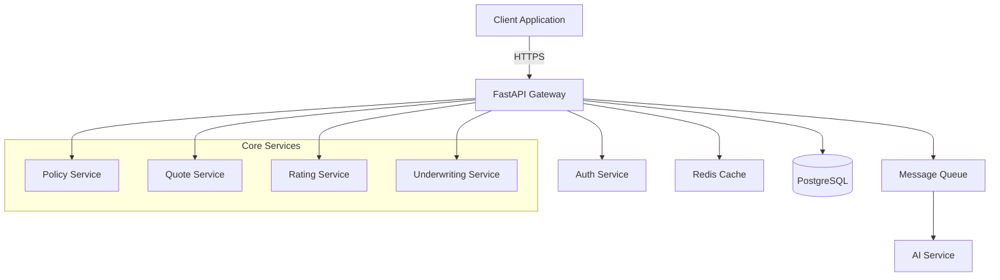

# Architecture Overview

## System Architecture

The MVP Policy Decision Backend is built using a modern, cloud-native architecture designed for high performance, scalability, and maintainability in the P&C insurance domain.

## Core Principles

### 1. **Domain-Driven Design (DDD)**

- Clear bounded contexts for insurance domains
- Rich domain models with business logic encapsulation
- Ubiquitous language aligned with insurance terminology

### 2. **Clean Architecture**

- Dependency inversion principle
- Business logic independent of frameworks
- Testable core domain

### 3. **Event-Driven Architecture**

- Asynchronous processing for long-running operations
- Event sourcing for audit trails
- CQRS for read/write optimization

## System Components

### API Layer (FastAPI)

```python
# High-performance async REST API
src/pd_prime_demo/
├── api/
│   ├── v1/
│   │   ├── endpoints/
│   │   │   ├── policies.py      # Policy management endpoints
│   │   │   ├── quotes.py        # Quote generation endpoints
│   │   │   ├── rates.py         # Rate calculation endpoints
│   │   │   └── underwriting.py  # AI-powered underwriting
│   │   └── dependencies.py      # Shared dependencies
│   └── middleware/
│       ├── authentication.py    # JWT authentication
│       ├── rate_limiting.py     # Rate limiting
│       └── monitoring.py        # Performance monitoring
```

### Domain Layer

```python
src/pd_prime_demo/
├── domain/
│   ├── models/
│   │   ├── policy.py           # Policy aggregate root
│   │   ├── quote.py            # Quote entity
│   │   ├── rate.py             # Rate value objects
│   │   └── underwriting.py     # Underwriting rules
│   ├── services/
│   │   ├── policy_service.py   # Policy business logic
│   │   ├── rating_engine.py    # Rate calculation engine
│   │   └── risk_assessment.py  # AI risk scoring
│   └── repositories/
│       └── interfaces.py        # Repository interfaces
```

### Infrastructure Layer

```python
src/pd_prime_demo/
├── infrastructure/
│   ├── database/
│   │   ├── models.py           # SQLAlchemy models
│   │   ├── repositories.py     # Repository implementations
│   │   └── migrations/         # Alembic migrations
│   ├── cache/
│   │   ├── redis_cache.py      # Redis caching
│   │   └── in_memory.py        # In-memory cache
│   └── external/
│       ├── ai_service.py       # AI service integration
│       └── document_service.py  # Document generation
```

## Data Flow Architecture



## Database Architecture

### Primary Database (PostgreSQL)

```sql
-- Core schema design
policies
├── id (UUID, PK)
├── policy_number (VARCHAR, UNIQUE)
├── status (ENUM)
├── effective_date (DATE)
├── expiration_date (DATE)
├── premium (DECIMAL)
├── created_at (TIMESTAMP)
└── updated_at (TIMESTAMP)

quotes
├── id (UUID, PK)
├── quote_number (VARCHAR, UNIQUE)
├── policy_type (ENUM)
├── coverage_limits (JSONB)
├── premium_calculated (DECIMAL)
├── valid_until (TIMESTAMP)
└── created_at (TIMESTAMP)

rates
├── id (UUID, PK)
├── state (VARCHAR)
├── policy_type (ENUM)
├── effective_date (DATE)
├── rate_factors (JSONB)
└── version (INTEGER)
```

### Caching Strategy

1. **Redis for Hot Data**
   - Active rate tables
   - Session data
   - Frequently accessed policies

2. **In-Memory Cache**
   - Configuration data
   - Reference data
   - Computed rate factors

## Security Architecture

### Authentication & Authorization

```python
# JWT-based authentication flow
1. User login → Validate credentials
2. Generate JWT token with claims
3. Token includes: user_id, roles, permissions
4. Every request validates token
5. Role-based access control (RBAC)
```

### Data Security

- **Encryption at Rest**: AES-256 for sensitive data
- **Encryption in Transit**: TLS 1.3 minimum
- **Field-Level Encryption**: PII data encrypted in database
- **Audit Logging**: All data access logged

## Performance Architecture

### Optimization Strategies

1. **Database Optimization**
   - Connection pooling with asyncpg
   - Query optimization with indexes
   - Materialized views for reports
   - Partitioning for large tables

2. **Caching Layers**
   - Redis for distributed cache
   - Application-level caching
   - CDN for static assets
   - Query result caching

3. **Async Processing**
   - FastAPI async endpoints
   - Background task processing
   - Event-driven workflows
   - Parallel rate calculations

### Performance Monitoring

```python
# Built-in performance monitoring
@performance_monitor
async def calculate_premium(policy_data: PolicyData) -> Decimal:
    # Tracks: execution time, memory usage, DB queries
    pass
```

## Scalability Design

### Horizontal Scaling

- **Stateless API servers**: Can scale horizontally
- **Database read replicas**: For read-heavy operations
- **Queue-based processing**: For async operations
- **Load balancing**: Round-robin or least-connections

### Vertical Scaling

- **Resource optimization**: Efficient memory usage
- **Connection pooling**: Minimize overhead
- **Batch processing**: For bulk operations

## Integration Architecture

### External Systems

1. **AI/ML Services**
   - REST API integration
   - Async processing for predictions
   - Fallback to rule-based systems

2. **Document Generation**
   - PDF generation service
   - Template-based documents
   - Async generation with callbacks

3. **Payment Processing**
   - PCI-compliant integration
   - Webhook-based updates
   - Idempotent operations

### API Design

```yaml
# OpenAPI 3.0 specification
/api/v1/policies:
  post:
    summary: Create new policy
    requestBody:
      content:
        application/json:
          schema:
            $ref: "#/components/schemas/PolicyCreate"
    responses:
      201:
        description: Policy created
        content:
          application/json:
            schema:
              $ref: "#/components/schemas/Policy"
```

## Deployment Architecture

### Container Strategy

```dockerfile
# Multi-stage build for optimization
FROM python:3.11-slim as builder
# Build stage with dependencies

FROM python:3.11-slim
# Runtime with minimal footprint
```

### Orchestration

- **Development**: Docker Compose
- **Production**: Kubernetes or Railway
- **CI/CD**: GitHub Actions → Railway/Vercel

## Error Handling Architecture

### Result Pattern

```python
@beartype
def calculate_rate(data: RateRequest) -> Result[RateResponse, RateError]:
    """No exceptions for control flow - Result types only"""
    if not validate_state(data.state):
        return Result.err(RateError.INVALID_STATE)

    rate = perform_calculation(data)
    return Result.ok(RateResponse(rate=rate))
```

### Error Recovery

1. **Retry Logic**: Exponential backoff for transient failures
2. **Circuit Breakers**: Prevent cascade failures
3. **Fallback Mechanisms**: Graceful degradation
4. **Dead Letter Queues**: For failed async operations

## Monitoring & Observability

### Metrics Collection

- **Application Metrics**: Response times, error rates
- **Business Metrics**: Quotes generated, policies bound
- **Infrastructure Metrics**: CPU, memory, disk usage

### Logging Strategy

```python
# Structured logging with context
logger.info(
    "policy_created",
    policy_id=policy.id,
    premium=policy.premium,
    user_id=current_user.id
)
```

### Distributed Tracing

- Request ID propagation
- Span creation for operations
- Performance bottleneck identification

## Future Architecture Considerations

### Microservices Migration Path

1. **Current**: Modular monolith
2. **Phase 1**: Extract rating service
3. **Phase 2**: Separate underwriting service
4. **Phase 3**: Full microservices

### Event Sourcing

- Capture all state changes as events
- Enable temporal queries
- Support for audit requirements
- Event replay capabilities

### Multi-Tenancy

- Schema-based isolation
- Row-level security
- Tenant-specific configurations
- Resource quotas per tenant
