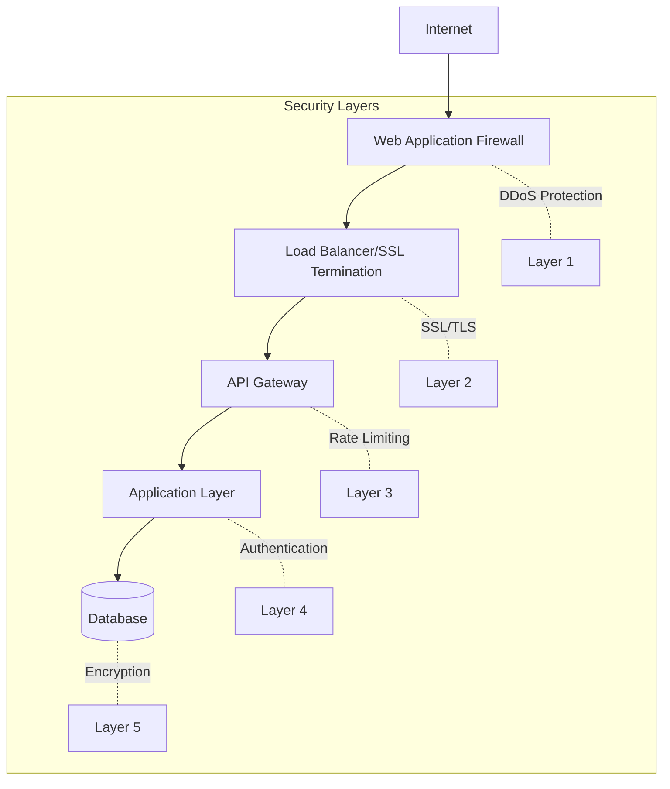

# Security Best Practices Guide

## Overview

This guide outlines comprehensive security measures and best practices for the MVP Policy Decision Backend, covering authentication, authorization, data protection, and compliance requirements for P&C insurance systems.

## Security Architecture

### Defense in Depth



## Authentication & Authorization

### JWT Implementation

```python
from datetime import datetime, timedelta, timezone
from typing import Optional
from jose import JWTError, jwt
from passlib.context import CryptContext
from pydantic import BaseModel
import secrets

# Configuration
SECRET_KEY = secrets.token_urlsafe(32)
ALGORITHM = "HS256"
ACCESS_TOKEN_EXPIRE_MINUTES = 30
REFRESH_TOKEN_EXPIRE_DAYS = 7

pwd_context = CryptContext(schemes=["bcrypt"], deprecated="auto")

class TokenData(BaseModel):
    username: Optional[str] = None
    scopes: list[str] = []

def create_access_token(
    data: dict,
    expires_delta: Optional[timedelta] = None
) -> str:
    to_encode = data.copy()
    if expires_delta:
        expire = datetime.now(timezone.utc) + expires_delta
    else:
        expire = datetime.now(timezone.utc) + timedelta(minutes=15)

    to_encode.update({
        "exp": expire,
        "iat": datetime.now(timezone.utc),
        "jti": secrets.token_urlsafe(16)  # JWT ID for revocation
    })

    encoded_jwt = jwt.encode(to_encode, SECRET_KEY, algorithm=ALGORITHM)
    return encoded_jwt

def verify_token(token: str) -> TokenData:
    credentials_exception = HTTPException(
        status_code=401,
        detail="Could not validate credentials",
        headers={"WWW-Authenticate": "Bearer"},
    )

    try:
        payload = jwt.decode(token, SECRET_KEY, algorithms=[ALGORITHM])
        username: str = payload.get("sub")
        if username is None:
            raise credentials_exception

        # Check if token is revoked
        if is_token_revoked(payload.get("jti")):
            raise credentials_exception

        token_scopes = payload.get("scopes", [])
        token_data = TokenData(username=username, scopes=token_scopes)
        return token_data
    except JWTError:
        raise credentials_exception
```

### OAuth2 with Scopes

```python
from fastapi import Depends, HTTPException, Security
from fastapi.security import OAuth2PasswordBearer, SecurityScopes

oauth2_scheme = OAuth2PasswordBearer(
    tokenUrl="token",
    scopes={
        "policies:read": "Read policies",
        "policies:write": "Create and update policies",
        "policies:delete": "Delete policies",
        "rates:read": "Read rate tables",
        "rates:write": "Modify rate tables",
        "admin": "Full administrative access"
    }
)

async def get_current_user(
    security_scopes: SecurityScopes,
    token: str = Depends(oauth2_scheme)
):
    if security_scopes.scopes:
        authenticate_value = f'Bearer scope="{security_scopes.scope_str}"'
    else:
        authenticate_value = "Bearer"

    credentials_exception = HTTPException(
        status_code=401,
        detail="Could not validate credentials",
        headers={"WWW-Authenticate": authenticate_value},
    )

    token_data = verify_token(token)

    # Check scopes
    for scope in security_scopes.scopes:
        if scope not in token_data.scopes:
            raise HTTPException(
                status_code=403,
                detail="Not enough permissions",
                headers={"WWW-Authenticate": authenticate_value},
            )

    user = await get_user(username=token_data.username)
    if user is None:
        raise credentials_exception

    return user

# Usage in endpoints
@app.get("/api/v1/policies")
async def read_policies(
    current_user: User = Security(get_current_user, scopes=["policies:read"])
):
    return await get_user_policies(current_user)
```

### Password Security

```python
from passlib.context import CryptContext
import secrets
import string

pwd_context = CryptContext(
    schemes=["argon2", "bcrypt"],
    deprecated="auto",
    argon2__memory_cost=65536,
    argon2__time_cost=3,
    argon2__parallelism=4
)

class PasswordPolicy:
    MIN_LENGTH = 12
    REQUIRE_UPPERCASE = True
    REQUIRE_LOWERCASE = True
    REQUIRE_DIGIT = True
    REQUIRE_SPECIAL = True
    SPECIAL_CHARS = "!@#$%^&*()_+-=[]{}|;:,.<>?"

    @classmethod
    def validate(cls, password: str) -> tuple[bool, list[str]]:
        errors = []

        if len(password) < cls.MIN_LENGTH:
            errors.append(f"Password must be at least {cls.MIN_LENGTH} characters")

        if cls.REQUIRE_UPPERCASE and not any(c.isupper() for c in password):
            errors.append("Password must contain uppercase letter")

        if cls.REQUIRE_LOWERCASE and not any(c.islower() for c in password):
            errors.append("Password must contain lowercase letter")

        if cls.REQUIRE_DIGIT and not any(c.isdigit() for c in password):
            errors.append("Password must contain digit")

        if cls.REQUIRE_SPECIAL and not any(c in cls.SPECIAL_CHARS for c in password):
            errors.append("Password must contain special character")

        # Check for common passwords
        if password.lower() in COMMON_PASSWORDS:
            errors.append("Password is too common")

        return len(errors) == 0, errors

def generate_secure_password(length: int = 16) -> str:
    """Generate a cryptographically secure password"""
    alphabet = string.ascii_letters + string.digits + PasswordPolicy.SPECIAL_CHARS
    while True:
        password = ''.join(secrets.choice(alphabet) for _ in range(length))
        if PasswordPolicy.validate(password)[0]:
            return password
```

## Data Protection

### Encryption at Rest

```python
from cryptography.fernet import Fernet
from cryptography.hazmat.primitives import hashes
from cryptography.hazmat.primitives.kdf.pbkdf2 import PBKDF2HMAC
import base64
import os

class FieldEncryption:
    def __init__(self, master_key: str):
        # Derive encryption key from master key
        kdf = PBKDF2HMAC(
            algorithm=hashes.SHA256(),
            length=32,
            salt=b'stable_salt',  # In production, use unique salt per field
            iterations=100000,
        )
        key = base64.urlsafe_b64encode(kdf.derive(master_key.encode()))
        self.cipher_suite = Fernet(key)

    def encrypt_field(self, value: str) -> str:
        """Encrypt sensitive field data"""
        if not value:
            return value
        return self.cipher_suite.encrypt(value.encode()).decode()

    def decrypt_field(self, encrypted_value: str) -> str:
        """Decrypt sensitive field data"""
        if not encrypted_value:
            return encrypted_value
        return self.cipher_suite.decrypt(encrypted_value.encode()).decode()

# Usage with Pydantic
from pydantic import BaseModel, field_validator

encryption = FieldEncryption(os.environ["MASTER_ENCRYPTION_KEY"])

class PolicyHolder(BaseModel):
    name: str
    ssn_encrypted: str
    driver_license_encrypted: str

    @field_validator('ssn_encrypted', mode='before')
    def encrypt_ssn(cls, v):
        if v and not v.startswith('gAAAAA'):  # Fernet encrypted strings start with this
            return encryption.encrypt_field(v)
        return v

    @property
    def ssn(self) -> str:
        return encryption.decrypt_field(self.ssn_encrypted)
```

### Database Security

```sql
-- Row Level Security (RLS) for PostgreSQL
CREATE POLICY policy_isolation ON policies
    FOR ALL
    TO application_role
    USING (tenant_id = current_setting('app.current_tenant')::uuid);

-- Enable RLS
ALTER TABLE policies ENABLE ROW LEVEL SECURITY;

-- Encrypt sensitive columns
CREATE EXTENSION IF NOT EXISTS pgcrypto;

-- Example: Encrypt SSN
UPDATE policy_holders
SET ssn_encrypted = pgp_sym_encrypt(ssn, current_setting('app.encryption_key'))
WHERE ssn_encrypted IS NULL;
```

### API Security

#### Input Validation

```python
from pydantic import BaseModel, Field, validator
from typing import Optional
import re
import bleach

class SecurePolicyInput(BaseModel):
    policy_number: str = Field(..., regex="^[A-Z0-9-]{10,20}$")
    description: Optional[str] = None

    @validator('description')
    def sanitize_html(cls, v):
        if v:
            # Remove any HTML tags
            return bleach.clean(v, tags=[], strip=True)
        return v

    @validator('*', pre=True)
    def prevent_injection(cls, v):
        if isinstance(v, str):
            # Check for SQL injection patterns
            sql_patterns = [
                r"(\b(SELECT|INSERT|UPDATE|DELETE|DROP|UNION|CREATE|ALTER)\b)",
                r"(--|;|\/\*|\*\/|xp_|sp_)",
                r"(\bOR\b.*=.*)",
            ]
            for pattern in sql_patterns:
                if re.search(pattern, v, re.IGNORECASE):
                    raise ValueError("Potential injection detected")
        return v
```

#### Rate Limiting

```python
from fastapi import Request, HTTPException
from fastapi.responses import JSONResponse
import time
from collections import defaultdict, deque
import asyncio

class RateLimiter:
    def __init__(self, requests: int, window: int):
        self.requests = requests
        self.window = window
        self.clients = defaultdict(deque)
        self.cleanup_task = None

    async def __call__(self, request: Request) -> bool:
        client_id = request.client.host
        now = time.time()

        # Clean old entries
        while self.clients[client_id] and self.clients[client_id][0] < now - self.window:
            self.clients[client_id].popleft()

        if len(self.clients[client_id]) >= self.requests:
            raise HTTPException(
                status_code=429,
                detail="Rate limit exceeded",
                headers={
                    "Retry-After": str(self.window),
                    "X-RateLimit-Limit": str(self.requests),
                    "X-RateLimit-Remaining": "0",
                    "X-RateLimit-Reset": str(int(self.clients[client_id][0] + self.window))
                }
            )

        self.clients[client_id].append(now)
        return True

# Apply rate limiting
rate_limiter = RateLimiter(requests=100, window=60)

@app.middleware("http")
async def rate_limit_middleware(request: Request, call_next):
    if request.url.path.startswith("/api/"):
        await rate_limiter(request)

    response = await call_next(request)
    return response
```

#### CORS Configuration

```python
from fastapi.middleware.cors import CORSMiddleware

# Strict CORS configuration
app.add_middleware(
    CORSMiddleware,
    allow_origins=[
        "https://app.example.com",
        "https://admin.example.com"
    ],
    allow_credentials=True,
    allow_methods=["GET", "POST", "PUT", "DELETE"],
    allow_headers=["Authorization", "Content-Type"],
    expose_headers=["X-Request-ID"],
    max_age=86400  # 24 hours
)
```

## Security Headers

```python
from fastapi import Request
from starlette.middleware.base import BaseHTTPMiddleware

class SecurityHeadersMiddleware(BaseHTTPMiddleware):
    async def dispatch(self, request: Request, call_next):
        response = await call_next(request)

        # Security headers
        response.headers["X-Content-Type-Options"] = "nosniff"
        response.headers["X-Frame-Options"] = "DENY"
        response.headers["X-XSS-Protection"] = "1; mode=block"
        response.headers["Strict-Transport-Security"] = "max-age=31536000; includeSubDomains; preload"
        response.headers["Referrer-Policy"] = "strict-origin-when-cross-origin"
        response.headers["Permissions-Policy"] = "geolocation=(), microphone=(), camera=()"

        # Content Security Policy
        csp = (
            "default-src 'self'; "
            "script-src 'self' 'unsafe-inline' https://cdn.example.com; "
            "style-src 'self' 'unsafe-inline'; "
            "img-src 'self' data: https:; "
            "font-src 'self'; "
            "connect-src 'self' https://api.example.com; "
            "frame-ancestors 'none'; "
            "base-uri 'self'; "
            "form-action 'self'"
        )
        response.headers["Content-Security-Policy"] = csp

        return response

app.add_middleware(SecurityHeadersMiddleware)
```

## Secrets Management

### Environment Variables

```python
from pydantic import BaseSettings, SecretStr
from typing import Optional
import os

class SecuritySettings(BaseSettings):
    # Sensitive configuration
    database_password: SecretStr
    jwt_secret_key: SecretStr
    encryption_key: SecretStr
    api_keys: dict[str, SecretStr] = {}

    # OAuth providers
    oauth_client_id: Optional[str] = None
    oauth_client_secret: Optional[SecretStr] = None

    class Config:
        env_file = ".env"
        env_file_encoding = "utf-8"
        case_sensitive = False

        # Custom parsing for complex types
        @classmethod
        def parse_env_var(cls, field_name: str, raw_val: str):
            if field_name == 'api_keys':
                # Parse JSON string to dict
                import json
                return json.loads(raw_val)
            return raw_val

# Validate all secrets are present
settings = SecuritySettings()

# Never log secrets
def safe_settings_dict():
    return {
        k: "***" if isinstance(v, SecretStr) else v
        for k, v in settings.dict().items()
    }
```

### Vault Integration

```python
import hvac
from functools import lru_cache

class VaultClient:
    def __init__(self, url: str, token: str):
        self.client = hvac.Client(url=url, token=token)
        if not self.client.is_authenticated():
            raise Exception("Vault authentication failed")

    @lru_cache(maxsize=100)
    def get_secret(self, path: str) -> dict:
        """Get secret from Vault with caching"""
        response = self.client.secrets.kv.v2.read_secret_version(
            path=path,
            mount_point="secret"
        )
        return response["data"]["data"]

    def get_database_credentials(self) -> dict:
        """Get dynamic database credentials"""
        response = self.client.read("database/creds/readonly")
        return {
            "username": response["data"]["username"],
            "password": response["data"]["password"]
        }

# Usage
vault = VaultClient(
    url=os.environ["VAULT_URL"],
    token=os.environ["VAULT_TOKEN"]
)

db_creds = vault.get_database_credentials()
```

## Audit Logging

```python
import json
from datetime import datetime
from fastapi import Request
from typing import Optional
import hashlib

class AuditLogger:
    def __init__(self):
        self.sensitive_fields = {
            "password", "ssn", "credit_card", "api_key", "token"
        }

    def mask_sensitive_data(self, data: dict) -> dict:
        """Recursively mask sensitive fields"""
        if not isinstance(data, dict):
            return data

        masked = {}
        for key, value in data.items():
            if any(sensitive in key.lower() for sensitive in self.sensitive_fields):
                masked[key] = "***REDACTED***"
            elif isinstance(value, dict):
                masked[key] = self.mask_sensitive_data(value)
            elif isinstance(value, list):
                masked[key] = [
                    self.mask_sensitive_data(item) if isinstance(item, dict) else item
                    for item in value
                ]
            else:
                masked[key] = value

        return masked

    async def log_request(
        self,
        request: Request,
        response_status: int,
        user_id: Optional[str] = None,
        action: Optional[str] = None
    ):
        # Create audit entry
        audit_entry = {
            "timestamp": datetime.utcnow().isoformat(),
            "request_id": request.state.request_id,
            "user_id": user_id,
            "ip_address": request.client.host,
            "method": request.method,
            "path": request.url.path,
            "action": action,
            "status_code": response_status,
            "user_agent": request.headers.get("user-agent"),
        }

        # Add request body hash (not the actual body)
        if request.method in ["POST", "PUT", "PATCH"]:
            body = await request.body()
            if body:
                audit_entry["body_hash"] = hashlib.sha256(body).hexdigest()

        # Log to secure audit trail
        await self.write_audit_log(audit_entry)

    async def write_audit_log(self, entry: dict):
        """Write to tamper-proof audit log"""
        # In production, write to:
        # - Immutable storage (e.g., AWS CloudTrail, Azure Monitor)
        # - SIEM system
        # - Compliance database
        pass

audit_logger = AuditLogger()

@app.middleware("http")
async def audit_middleware(request: Request, call_next):
    # Skip health checks
    if request.url.path == "/health":
        return await call_next(request)

    response = await call_next(request)

    # Log security-relevant requests
    if request.url.path.startswith("/api/") and request.method != "GET":
        user_id = getattr(request.state, "user_id", None)
        await audit_logger.log_request(
            request=request,
            response_status=response.status_code,
            user_id=user_id
        )

    return response
```

## Vulnerability Scanning

### Static Analysis

```bash
# Bandit for Python security issues
bandit -r src/ -f json -o bandit-report.json

# Safety for dependency vulnerabilities
safety check --json --output safety-report.json

# Semgrep for custom rules
semgrep --config=auto --json --output=semgrep-report.json src/
```

### Dependency Scanning

```python
# scripts/security_scan.py
import subprocess
import json
import sys

def run_security_checks():
    checks = [
        ("Bandit", ["bandit", "-r", "src/", "-f", "json"]),
        ("Safety", ["safety", "check", "--json"]),
        ("pip-audit", ["pip-audit", "--format", "json"]),
    ]

    results = {}
    has_issues = False

    for name, command in checks:
        try:
            result = subprocess.run(
                command,
                capture_output=True,
                text=True
            )

            if result.returncode != 0:
                has_issues = True
                results[name] = json.loads(result.stdout)
            else:
                results[name] = "No issues found"

        except Exception as e:
            results[name] = f"Error: {str(e)}"
            has_issues = True

    # Write comprehensive report
    with open("security-report.json", "w") as f:
        json.dump(results, f, indent=2)

    if has_issues:
        print("Security issues found! Check security-report.json")
        sys.exit(1)
    else:
        print("All security checks passed!")

if __name__ == "__main__":
    run_security_checks()
```

## Compliance

### PCI DSS Requirements

```python
# PCI compliance helpers
class PCICompliance:
    @staticmethod
    def mask_pan(pan: str) -> str:
        """Mask Primary Account Number per PCI DSS"""
        if len(pan) < 13:
            return "*" * len(pan)
        return pan[:6] + "*" * (len(pan) - 10) + pan[-4:]

    @staticmethod
    def validate_card_data_storage(model: BaseModel):
        """Ensure no prohibited card data is stored"""
        prohibited_fields = [
            "cvv", "cvc", "cvv2", "cvc2", "pin", "pin_block"
        ]

        for field_name in model.__fields__:
            if any(prohibited in field_name.lower() for prohibited in prohibited_fields):
                raise ValueError(f"Prohibited field for PCI compliance: {field_name}")
```

### GDPR Compliance

```python
class GDPRCompliance:
    @staticmethod
    async def export_user_data(user_id: str) -> dict:
        """Export all user data for GDPR data portability"""
        data = {
            "user": await get_user(user_id),
            "policies": await get_user_policies(user_id),
            "claims": await get_user_claims(user_id),
            "audit_logs": await get_user_audit_logs(user_id)
        }

        return data

    @staticmethod
    async def anonymize_user_data(user_id: str):
        """Anonymize user data for GDPR right to be forgotten"""
        # Replace PII with anonymized values
        await db.execute("""
            UPDATE users
            SET
                email = CONCAT('deleted_', id, '@example.com'),
                name = 'ANONYMIZED',
                phone = NULL,
                address = NULL,
                date_of_birth = NULL
            WHERE id = $1
        """, user_id)
```

## Security Checklist

### Development

- [ ] All dependencies are up to date
- [ ] Security scanning in pre-commit hooks
- [ ] Secrets are never committed to git
- [ ] Environment-specific configuration
- [ ] Input validation on all endpoints
- [ ] Output encoding to prevent XSS
- [ ] SQL injection prevention via ORM/parameterized queries
- [ ] CSRF protection enabled
- [ ] Rate limiting implemented
- [ ] Audit logging configured

### Deployment

- [ ] HTTPS enforced everywhere
- [ ] Security headers configured
- [ ] CORS properly restricted
- [ ] Database encrypted at rest
- [ ] Backups encrypted
- [ ] Secrets in secure vault
- [ ] Monitoring and alerting active
- [ ] Incident response plan documented
- [ ] Regular security assessments scheduled
- [ ] Compliance requirements verified

## Incident Response

### Security Incident Procedure

1. **Detection**
   - Monitor security alerts
   - Review audit logs
   - Check anomaly detection

2. **Containment**
   - Isolate affected systems
   - Revoke compromised credentials
   - Block malicious IPs

3. **Investigation**
   - Analyze audit logs
   - Review system changes
   - Identify attack vector

4. **Remediation**
   - Patch vulnerabilities
   - Update security controls
   - Reset credentials

5. **Recovery**
   - Restore from clean backups
   - Verify system integrity
   - Resume normal operations

6. **Post-Incident**
   - Document lessons learned
   - Update security procedures
   - Improve detection capabilities
