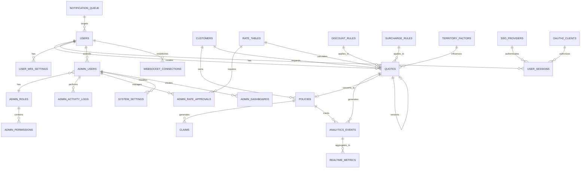

# Database Schema Documentation

## Overview

This document provides a comprehensive overview of the database schema for the P&C Insurance Platform. The schema is designed to support high-performance operations, real-time features, and enterprise-grade security.

## Entity Relationship Diagram



## Core Tables

### 1. Users & Authentication

#### users
Primary user table for authentication and identification.

| Column | Type | Description |
|--------|------|-------------|
| id | UUID | Primary key |
| email | VARCHAR(255) | Unique email address |
| password_hash | TEXT | Bcrypt password hash |
| first_name | VARCHAR(100) | User's first name |
| last_name | VARCHAR(100) | User's last name |
| role | VARCHAR(50) | User role (agent, underwriter, admin, system) |
| is_active | BOOLEAN | Account active status |
| last_login_at | TIMESTAMPTZ | Last login timestamp |
| created_at | TIMESTAMPTZ | Creation timestamp |
| updated_at | TIMESTAMPTZ | Last update timestamp |

**Indexes:**
- `ix_users_email` - Email lookup
- `ix_users_role` - Role-based queries
- `ix_users_is_active` - Active user filtering

### 2. Business Entities

#### customers
Customer information storage.

| Column | Type | Description |
|--------|------|-------------|
| id | UUID | Primary key |
| external_id | VARCHAR(255) | External system identifier |
| data | JSONB | Flexible customer data |
| created_at | TIMESTAMPTZ | Creation timestamp |
| updated_at | TIMESTAMPTZ | Last update timestamp |

**Indexes:**
- `ix_customers_external_id` - External ID lookup
- `ix_customers_data_gin` - JSONB search (GIN index)

#### policies
Insurance policy records.

| Column | Type | Description |
|--------|------|-------------|
| id | UUID | Primary key |
| policy_number | VARCHAR(255) | Unique policy number |
| customer_id | UUID | Foreign key to customers |
| data | JSONB | Policy details |
| status | VARCHAR(50) | Policy status |
| effective_date | DATE | Policy start date |
| expiration_date | DATE | Policy end date |
| created_at | TIMESTAMPTZ | Creation timestamp |
| updated_at | TIMESTAMPTZ | Last update timestamp |

**Indexes:**
- `ix_policies_policy_number` - Policy number lookup
- `ix_policies_customer_id` - Customer policies
- `ix_policies_status` - Status filtering
- `ix_policies_dates` - Date range queries
- `ix_policies_data_gin` - JSONB search

#### claims
Insurance claim records.

| Column | Type | Description |
|--------|------|-------------|
| id | UUID | Primary key |
| claim_number | VARCHAR(255) | Unique claim number |
| policy_id | UUID | Foreign key to policies |
| data | JSONB | Claim details |
| status | VARCHAR(50) | Claim status |
| amount_claimed | DECIMAL(12,2) | Claimed amount |
| amount_approved | DECIMAL(12,2) | Approved amount |
| submitted_at | TIMESTAMPTZ | Submission timestamp |
| resolved_at | TIMESTAMPTZ | Resolution timestamp |
| created_at | TIMESTAMPTZ | Creation timestamp |
| updated_at | TIMESTAMPTZ | Last update timestamp |

**Indexes:**
- `ix_claims_claim_number` - Claim number lookup
- `ix_claims_policy_id` - Policy claims
- `ix_claims_status` - Status filtering
- `ix_claims_status_submitted` - Status and date composite
- `ix_claims_data_gin` - JSONB search

### 3. Quote System

#### quotes
Comprehensive quote management with versioning support.

| Column | Type | Description |
|--------|------|-------------|
| id | UUID | Primary key |
| quote_number | VARCHAR(20) | Format: QUOT-YYYY-NNNNNNN |
| customer_id | UUID | Foreign key to customers |
| status | VARCHAR(20) | Quote status |
| product_type | VARCHAR(20) | Insurance product type |
| state | VARCHAR(2) | State code |
| zip_code | VARCHAR(10) | ZIP code |
| effective_date | DATE | Requested effective date |
| base_premium | DECIMAL(10,2) | Base premium amount |
| total_premium | DECIMAL(10,2) | Total premium |
| monthly_premium | DECIMAL(10,2) | Monthly payment |
| vehicle_info | JSONB | Vehicle details (auto) |
| property_info | JSONB | Property details (home) |
| drivers | JSONB | Driver information array |
| coverage_selections | JSONB | Selected coverages |
| discounts_applied | JSONB | Applied discounts |
| surcharges_applied | JSONB | Applied surcharges |
| rating_factors | JSONB | Rating calculation factors |
| ai_risk_score | DECIMAL(3,2) | AI risk assessment (0-1) |
| ai_risk_factors | JSONB | AI risk factors |
| conversion_probability | DECIMAL(3,2) | Conversion likelihood |
| version | INTEGER | Quote version number |
| parent_quote_id | UUID | Parent quote for versioning |
| expires_at | TIMESTAMPTZ | Quote expiration |
| converted_to_policy_id | UUID | Resulting policy ID |
| declined_reasons | JSONB | Decline reasons |
| created_by | UUID | Creating user |
| updated_by | UUID | Last updating user |
| created_at | TIMESTAMPTZ | Creation timestamp |
| updated_at | TIMESTAMPTZ | Last update timestamp |

**Indexes:**
- `ix_quotes_customer_id` - Customer quotes
- `ix_quotes_status` - Status filtering
- `ix_quotes_quote_number` - Quote number lookup
- `ix_quotes_expires_at` - Expiration queries
- `ix_quotes_state_product` - State/product composite
- `ix_quotes_created_at` - Time-based queries
- `ix_quotes_vehicle_info_gin` - Vehicle search
- `ix_quotes_coverage_selections_gin` - Coverage search
- `ix_quotes_customer_status_created` - Customer quote history

### 4. Rating Engine

#### rate_tables
Base rates by state, product, and coverage type.

| Column | Type | Description |
|--------|------|-------------|
| id | UUID | Primary key |
| state | VARCHAR(2) | State code |
| product_type | VARCHAR(20) | Product type |
| coverage_type | VARCHAR(50) | Coverage type |
| base_rate | DECIMAL(8,6) | Base rate multiplier |
| min_premium | DECIMAL(10,2) | Minimum premium |
| max_premium | DECIMAL(10,2) | Maximum premium |
| territory_factors | JSONB | ZIP-based multipliers |
| vehicle_factors | JSONB | Vehicle-based multipliers |
| driver_factors | JSONB | Driver-based multipliers |
| credit_factors | JSONB | Credit-based multipliers |
| effective_date | DATE | Rate effective date |
| expiration_date | DATE | Rate expiration date |
| filing_id | VARCHAR(50) | Regulatory filing ID |
| approved_by | VARCHAR(100) | Approver name |
| created_at | TIMESTAMPTZ | Creation timestamp |
| updated_at | TIMESTAMPTZ | Last update timestamp |

**Indexes:**
- `ix_rate_tables_state_product` - State/product lookup
- `ix_rate_tables_effective_date` - Date-based queries
- `ix_rate_tables_state_product_coverage_date` - Full lookup

#### discount_rules
Configurable discount rules with eligibility criteria.

| Column | Type | Description |
|--------|------|-------------|
| id | UUID | Primary key |
| code | VARCHAR(20) | Unique discount code |
| name | VARCHAR(100) | Discount name |
| description | TEXT | Discount description |
| product_types | JSONB | Applicable products |
| states | JSONB | Applicable states |
| discount_type | VARCHAR(20) | percentage or fixed |
| discount_value | DECIMAL(10,2) | Discount amount |
| max_discount_amount | DECIMAL(10,2) | Maximum discount cap |
| eligibility_rules | JSONB | Eligibility criteria |
| stackable | BOOLEAN | Can combine with others |
| priority | INTEGER | Application order |
| effective_date | DATE | Start date |
| expiration_date | DATE | End date |
| created_at | TIMESTAMPTZ | Creation timestamp |

**Indexes:**
- `ix_discount_rules_code` - Code lookup
- `ix_discount_rules_effective_date` - Date filtering

#### surcharge_rules
Risk-based surcharge rules.

| Column | Type | Description |
|--------|------|-------------|
| id | UUID | Primary key |
| code | VARCHAR(20) | Unique surcharge code |
| name | VARCHAR(100) | Surcharge name |
| description | TEXT | Surcharge description |
| product_types | JSONB | Applicable products |
| states | JSONB | Applicable states |
| surcharge_type | VARCHAR(20) | percentage or fixed |
| surcharge_value | DECIMAL(10,2) | Surcharge amount |
| max_surcharge_amount | DECIMAL(10,2) | Maximum surcharge cap |
| trigger_conditions | JSONB | Triggering conditions |
| priority | INTEGER | Application order |
| effective_date | DATE | Start date |
| expiration_date | DATE | End date |
| created_at | TIMESTAMPTZ | Creation timestamp |

**Indexes:**
- `ix_surcharge_rules_code` - Code lookup
- `ix_surcharge_rules_effective_date` - Date filtering

#### territory_factors
Geographic rating factors by ZIP code.

| Column | Type | Description |
|--------|------|-------------|
| id | UUID | Primary key |
| state | VARCHAR(2) | State code |
| zip_code | VARCHAR(10) | ZIP code |
| product_type | VARCHAR(20) | Product type |
| base_factor | DECIMAL(5,4) | Base multiplier |
| loss_ratio_factor | DECIMAL(5,4) | Loss ratio adjustment |
| catastrophe_factor | DECIMAL(5,4) | Catastrophe risk |
| effective_date | DATE | Start date |
| expiration_date | DATE | End date |
| created_at | TIMESTAMPTZ | Creation timestamp |

**Indexes:**
- `ix_territory_factors_state_zip` - Geographic lookup
- `ix_territory_factors_zip_code` - ZIP lookup
- `ix_territory_factors_state_zip_product_date` - Full lookup

### 5. Security & Compliance

#### sso_providers
Single Sign-On provider configurations.

| Column | Type | Description |
|--------|------|-------------|
| id | UUID | Primary key |
| provider_name | VARCHAR(50) | Provider name |
| provider_type | VARCHAR(20) | Provider type |
| client_id | VARCHAR(255) | OAuth client ID |
| client_secret_encrypted | TEXT | Encrypted secret |
| issuer_url | TEXT | OIDC issuer URL |
| authorize_url | TEXT | Authorization endpoint |
| token_url | TEXT | Token endpoint |
| userinfo_url | TEXT | User info endpoint |
| enabled | BOOLEAN | Provider enabled |
| auto_create_users | BOOLEAN | Auto-provision users |
| allowed_domains | JSONB | Email domain whitelist |
| created_at | TIMESTAMPTZ | Creation timestamp |
| updated_at | TIMESTAMPTZ | Last update timestamp |

#### oauth2_clients
OAuth2 client registrations for API access.

| Column | Type | Description |
|--------|------|-------------|
| id | UUID | Primary key |
| client_id | VARCHAR(100) | OAuth client ID |
| client_secret_hash | TEXT | Hashed secret |
| client_name | VARCHAR(100) | Client name |
| redirect_uris | JSONB | Allowed redirects |
| allowed_grant_types | JSONB | Grant types |
| allowed_scopes | JSONB | OAuth scopes |
| rate_limit_per_minute | INTEGER | Rate limit |
| rate_limit_per_hour | INTEGER | Hourly limit |
| active | BOOLEAN | Client active |
| expires_at | TIMESTAMPTZ | Expiration |
| created_at | TIMESTAMPTZ | Creation timestamp |

#### user_mfa_settings
Multi-factor authentication settings per user.

| Column | Type | Description |
|--------|------|-------------|
| user_id | UUID | Primary key, FK to users |
| totp_secret_encrypted | TEXT | TOTP secret |
| totp_enabled | BOOLEAN | TOTP enabled |
| webauthn_credentials | JSONB | WebAuthn data |
| webauthn_enabled | BOOLEAN | WebAuthn enabled |
| sms_phone_encrypted | TEXT | SMS phone |
| sms_enabled | BOOLEAN | SMS enabled |
| recovery_codes_encrypted | JSONB | Recovery codes |
| created_at | TIMESTAMPTZ | Creation timestamp |
| updated_at | TIMESTAMPTZ | Last update timestamp |

#### user_sessions
Active user session tracking.

| Column | Type | Description |
|--------|------|-------------|
| id | UUID | Primary key |
| user_id | UUID | Foreign key to users |
| session_token_hash | VARCHAR(255) | Session token |
| ip_address | INET | Client IP |
| user_agent | TEXT | Browser info |
| device_fingerprint | VARCHAR(255) | Device ID |
| auth_method | VARCHAR(50) | Auth method used |
| sso_provider_id | UUID | SSO provider used |
| created_at | TIMESTAMPTZ | Session start |
| last_activity_at | TIMESTAMPTZ | Last activity |
| expires_at | TIMESTAMPTZ | Expiration |
| revoked_at | TIMESTAMPTZ | Revocation time |
| revoke_reason | VARCHAR(100) | Revoke reason |

**Indexes:**
- `ix_user_sessions_user_id` - User sessions
- `ix_user_sessions_session_token_hash` - Token lookup (unique)
- `ix_user_sessions_expires_at` - Expiration queries

#### audit_logs (Partitioned)
Comprehensive audit trail with monthly partitions.

| Column | Type | Description |
|--------|------|-------------|
| id | UUID | Primary key |
| user_id | UUID | Acting user |
| ip_address | INET | Client IP |
| user_agent | TEXT | Browser info |
| session_id | UUID | Session ID |
| action | VARCHAR(100) | Action performed |
| resource_type | VARCHAR(50) | Resource type |
| resource_id | UUID | Resource ID |
| request_method | VARCHAR(10) | HTTP method |
| request_path | TEXT | API path |
| request_body | JSONB | Request data |
| response_status | INTEGER | HTTP status |
| response_time_ms | INTEGER | Response time |
| risk_score | DECIMAL(3,2) | Risk assessment |
| security_alerts | JSONB | Security flags |
| created_at | TIMESTAMPTZ | Event timestamp |

**Partitioning:** Monthly partitions (e.g., `audit_logs_2025_01`)

**Indexes:**
- `ix_audit_logs_user_id` - User activity
- `ix_audit_logs_created_at` - Time queries
- `ix_audit_logs_action` - Action filtering
- `ix_audit_logs_resource` - Resource queries

### 6. Real-Time Analytics

#### websocket_connections
Active WebSocket connection tracking.

| Column | Type | Description |
|--------|------|-------------|
| connection_id | UUID | Primary key |
| user_id | UUID | Connected user |
| connected_at | TIMESTAMPTZ | Connection time |
| disconnected_at | TIMESTAMPTZ | Disconnection time |
| last_ping_at | TIMESTAMPTZ | Last heartbeat |
| subscribed_channels | JSONB | Channel subscriptions |
| connection_metadata | JSONB | Connection metadata |
| ip_address | INET | Client IP |
| user_agent | TEXT | Browser info |
| client_version | VARCHAR(20) | Client version |

**Indexes:**
- `ix_websocket_connections_user_id` - User connections
- `ix_websocket_connections_connected_at` - Time queries
- `ix_websocket_connections_active` - Active connections (partial)

#### analytics_events
Event stream for real-time analytics.

| Column | Type | Description |
|--------|------|-------------|
| id | UUID | Primary key |
| event_type | VARCHAR(50) | Event type |
| event_category | VARCHAR(50) | Event category |
| event_data | JSONB | Event payload |
| user_id | UUID | Related user |
| session_id | UUID | Session context |
| quote_id | UUID | Related quote |
| policy_id | UUID | Related policy |
| value | DECIMAL(10,2) | Numeric value |
| duration_ms | INTEGER | Duration |
| state | VARCHAR(2) | State code |
| zip_code | VARCHAR(10) | ZIP code |
| created_at | TIMESTAMPTZ | Event time |

**Indexes:**
- `ix_analytics_events_created_at` - Time queries
- `ix_analytics_events_type_category` - Type filtering
- `ix_analytics_events_user_id` - User events
- `ix_analytics_events_time_series` - Time series queries
- `ix_analytics_events_geo` - Geographic queries

#### notification_queue
Notification delivery queue.

| Column | Type | Description |
|--------|------|-------------|
| id | UUID | Primary key |
| notification_type | VARCHAR(50) | Notification type |
| priority | VARCHAR(20) | Priority level |
| channel | VARCHAR(20) | Delivery channel |
| user_id | UUID | Target user |
| broadcast_channel | VARCHAR(50) | Broadcast channel |
| title | VARCHAR(200) | Notification title |
| message | TEXT | Message body |
| data | JSONB | Additional data |
| action_url | TEXT | Action URL |
| status | VARCHAR(20) | Delivery status |
| attempts | INTEGER | Delivery attempts |
| delivered_at | TIMESTAMPTZ | Delivery time |
| read_at | TIMESTAMPTZ | Read time |
| error_message | TEXT | Error details |
| scheduled_for | TIMESTAMPTZ | Schedule time |
| expires_at | TIMESTAMPTZ | Expiration |
| created_at | TIMESTAMPTZ | Creation time |
| updated_at | TIMESTAMPTZ | Last update |

**Indexes:**
- `ix_notification_queue_user_id` - User notifications
- `ix_notification_queue_status` - Status filtering
- `ix_notification_queue_pending` - Pending notifications (partial)

#### realtime_metrics
Pre-aggregated metrics for dashboards.

| Column | Type | Description |
|--------|------|-------------|
| id | UUID | Primary key |
| metric_name | VARCHAR(100) | Metric name |
| metric_type | VARCHAR(20) | Metric type |
| aggregation_period | VARCHAR(20) | Time period |
| period_start | TIMESTAMPTZ | Period start |
| period_end | TIMESTAMPTZ | Period end |
| dimensions | JSONB | Metric dimensions |
| value | DECIMAL(12,4) | Metric value |
| count | INTEGER | Data points |
| min_value | DECIMAL(12,4) | Minimum |
| max_value | DECIMAL(12,4) | Maximum |
| sum_value | DECIMAL(15,4) | Sum |
| created_at | TIMESTAMPTZ | Creation time |
| updated_at | TIMESTAMPTZ | Last update |

**Indexes:**
- `ix_realtime_metrics_metric_name` - Metric lookup
- `ix_realtime_metrics_period_start` - Time queries
- `ix_realtime_metrics_time_series` - Time series queries

### 7. Admin System

#### admin_roles
Hierarchical admin role definitions.

| Column | Type | Description |
|--------|------|-------------|
| id | UUID | Primary key |
| name | VARCHAR(50) | Role name |
| description | TEXT | Role description |
| permissions | JSONB | Permission array |
| parent_role_id | UUID | Parent role |
| is_system_role | BOOLEAN | System role flag |
| created_at | TIMESTAMPTZ | Creation time |
| updated_at | TIMESTAMPTZ | Last update |

#### admin_users
Admin user extensions with enhanced security.

| Column | Type | Description |
|--------|------|-------------|
| id | UUID | Primary key |
| user_id | UUID | Base user reference |
| role_id | UUID | Admin role |
| is_super_admin | BOOLEAN | Super admin flag |
| department | VARCHAR(100) | Department |
| employee_id | VARCHAR(50) | Employee ID |
| requires_2fa | BOOLEAN | 2FA requirement |
| ip_whitelist | JSONB | Allowed IPs |
| access_hours | JSONB | Access schedule |
| last_activity_at | TIMESTAMPTZ | Last activity |
| total_actions | INTEGER | Action count |
| status | VARCHAR(20) | Account status |
| deactivated_at | TIMESTAMPTZ | Deactivation time |
| deactivation_reason | TEXT | Deactivation reason |
| created_at | TIMESTAMPTZ | Creation time |
| updated_at | TIMESTAMPTZ | Last update |
| created_by | UUID | Creating admin |

**Indexes:**
- `ix_admin_users_role_id` - Role queries
- `ix_admin_users_status` - Status filtering
- `ix_admin_users_department` - Department queries

#### admin_permissions
Permission registry for role-based access control.

| Column | Type | Description |
|--------|------|-------------|
| id | UUID | Primary key |
| resource | VARCHAR(50) | Resource name |
| action | VARCHAR(50) | Action name |
| description | TEXT | Permission description |
| risk_level | VARCHAR(20) | Risk level |
| requires_2fa | BOOLEAN | 2FA requirement |
| requires_approval | BOOLEAN | Approval needed |
| created_at | TIMESTAMPTZ | Creation time |

#### system_settings
System configuration management.

| Column | Type | Description |
|--------|------|-------------|
| id | UUID | Primary key |
| category | VARCHAR(50) | Setting category |
| key | VARCHAR(100) | Setting key |
| value | JSONB | Setting value |
| data_type | VARCHAR(20) | Expected type |
| validation_rules | JSONB | Validation rules |
| default_value | JSONB | Default value |
| description | TEXT | Description |
| display_name | VARCHAR(100) | Display name |
| help_text | TEXT | Help text |
| is_sensitive | BOOLEAN | Sensitive flag |
| is_encrypted | BOOLEAN | Encrypted flag |
| requires_restart | BOOLEAN | Restart required |
| last_modified_by | UUID | Last modifier |
| last_modified_at | TIMESTAMPTZ | Last modified |
| created_at | TIMESTAMPTZ | Creation time |

**Indexes:**
- `ix_system_settings_category` - Category queries
- `ix_system_settings_is_sensitive` - Sensitive filtering

#### admin_activity_logs
Detailed admin action logging.

| Column | Type | Description |
|--------|------|-------------|
| id | UUID | Primary key |
| admin_user_id | UUID | Acting admin |
| action | VARCHAR(100) | Action performed |
| resource_type | VARCHAR(50) | Resource type |
| resource_id | UUID | Resource ID |
| resource_name | VARCHAR(200) | Resource name |
| old_values | JSONB | Previous values |
| new_values | JSONB | New values |
| change_summary | TEXT | Change summary |
| ip_address | INET | Client IP |
| user_agent | TEXT | Browser info |
| request_id | UUID | Request ID |
| session_id | UUID | Session ID |
| status | VARCHAR(20) | Action status |
| error_message | TEXT | Error details |
| duration_ms | INTEGER | Duration |
| risk_score | INTEGER | Risk score (0-100) |
| risk_factors | JSONB | Risk factors |
| created_at | TIMESTAMPTZ | Event time |

**Indexes:**
- `ix_admin_activity_logs_admin_user_id` - Admin activity
- `ix_admin_activity_logs_created_at` - Time queries
- `ix_admin_activity_logs_resource` - Resource queries
- `ix_admin_activity_logs_action` - Action filtering
- `ix_admin_activity_logs_high_risk` - High-risk activities (partial)

#### admin_dashboards
Configurable admin dashboard definitions.

| Column | Type | Description |
|--------|------|-------------|
| id | UUID | Primary key |
| name | VARCHAR(100) | Dashboard name |
| slug | VARCHAR(100) | URL slug |
| description | TEXT | Description |
| layout | JSONB | Layout config |
| widgets | JSONB | Widget config |
| filters | JSONB | Default filters |
| refresh_interval | INTEGER | Refresh seconds |
| required_permission | VARCHAR(100) | Required permission |
| is_default | BOOLEAN | Default flag |
| is_system | BOOLEAN | System dashboard |
| created_by | UUID | Creator |
| is_public | BOOLEAN | Public visibility |
| created_at | TIMESTAMPTZ | Creation time |
| updated_at | TIMESTAMPTZ | Last update |

#### admin_rate_approvals
Rate change approval workflow.

| Column | Type | Description |
|--------|------|-------------|
| id | UUID | Primary key |
| rate_table_id | UUID | Rate table |
| submitted_by | UUID | Submitter |
| submitted_at | TIMESTAMPTZ | Submission time |
| submission_notes | TEXT | Submission notes |
| approved_by | UUID | Approver |
| approved_at | TIMESTAMPTZ | Approval time |
| approval_notes | TEXT | Approval notes |
| rejected_by | UUID | Rejector |
| rejected_at | TIMESTAMPTZ | Rejection time |
| rejection_reason | TEXT | Rejection reason |
| changes_summary | JSONB | Change summary |
| impact_analysis | JSONB | Impact analysis |
| effective_date | DATE | Effective date |
| filing_reference | VARCHAR(100) | Filing reference |
| status | VARCHAR(20) | Approval status |
| priority | VARCHAR(20) | Priority level |
| requires_filing | BOOLEAN | Filing required |
| created_at | TIMESTAMPTZ | Creation time |
| updated_at | TIMESTAMPTZ | Last update |

**Indexes:**
- `ix_admin_rate_approvals_status` - Status filtering
- `ix_admin_rate_approvals_submitted_by` - Submitter queries
- `ix_admin_rate_approvals_effective_date` - Date queries
- `ix_admin_rate_approvals_pending` - Pending approvals (partial)

## Performance Considerations

### 1. Indexing Strategy

- **B-tree indexes** for equality and range queries
- **GIN indexes** for JSONB full-text search
- **Partial indexes** for filtered queries (e.g., active connections)
- **Composite indexes** for multi-column queries
- **Expression indexes** for computed values

### 2. Partitioning

- **audit_logs**: Monthly range partitioning for efficient data retention
- **analytics_events**: Consider partitioning by created_at for high-volume
- Automatic partition creation via `create_monthly_audit_partition()` function

### 3. Query Optimization

- Use prepared statements for repeated queries
- Leverage connection pooling (pgBouncer recommended)
- Monitor slow queries with pg_stat_statements
- Regular VACUUM and ANALYZE operations

### 4. Data Retention

- Implement data_retention_policies table rules
- Archive old partitions to cold storage
- Use pg_cron for automated cleanup

## Security Features

### 1. Row Level Security (RLS)

- Enabled on `admin_activity_logs` and `system_settings`
- Policies restrict access based on current user context
- Super admins bypass RLS restrictions

### 2. Encryption

- Sensitive fields marked with `_encrypted` suffix
- Use application-level encryption with KMS
- SSL/TLS for all database connections

### 3. Audit Trail

- Comprehensive audit_logs table
- Admin-specific activity logging
- Trigger-based updated_at timestamps

### 4. Access Control

- Role-based permissions via admin_roles
- Permission validation functions
- IP whitelisting for admin users

## Maintenance Operations

### 1. Regular Tasks

```sql
-- Update table statistics
ANALYZE;

-- Vacuum tables
VACUUM (VERBOSE, ANALYZE);

-- Reindex for performance
REINDEX DATABASE pd_prime_demo;

-- Create next month's audit partition
SELECT create_monthly_audit_partition();
```

### 2. Monitoring Queries

```sql
-- Check table sizes
SELECT 
    schemaname,
    tablename,
    pg_size_pretty(pg_total_relation_size(schemaname||'.'||tablename)) AS size
FROM pg_tables
WHERE schemaname = 'public'
ORDER BY pg_total_relation_size(schemaname||'.'||tablename) DESC;

-- Monitor slow queries
SELECT 
    query,
    calls,
    total_time,
    mean_time,
    max_time
FROM pg_stat_statements
ORDER BY mean_time DESC
LIMIT 20;

-- Check index usage
SELECT 
    schemaname,
    tablename,
    indexname,
    idx_scan,
    idx_tup_read,
    idx_tup_fetch
FROM pg_stat_user_indexes
ORDER BY idx_scan;
```

### 3. Backup Strategy

- Daily full backups with pg_dump
- Continuous archiving with WAL-E/WAL-G
- Point-in-time recovery capability
- Test restore procedures monthly

## Migration Notes

1. Always use Alembic for schema changes
2. Include both upgrade() and downgrade() functions
3. Test migrations on staging first
4. Back up database before major migrations
5. Monitor performance after schema changes

## Future Considerations

1. **Sharding**: Consider sharding quotes/policies by state for scale
2. **Read Replicas**: Implement read replicas for reporting queries
3. **Caching Layer**: Add Redis for frequently accessed data
4. **Time-Series DB**: Consider TimescaleDB for analytics_events
5. **Search Engine**: Elasticsearch for full-text search capabilities